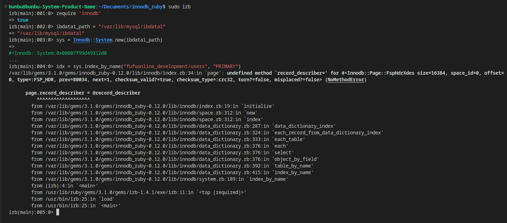

### Ở tại source này
```
sudo ruby -r rubygems -I lib bin/innodb_space ...

sudo ruby -r rubygems -I lib bin/innodb_space -s /var/lib/mysql/ibdata1 -T fufuonline_development/users -I PRIMARY index-recurse

sudo ruby -r rubygems -I lib bin/innodb_space -f /var/lib/mysql/fufuonline_development/users.ibd space-indexes
```
### Vọc
```
$ irb -r innodb
> sys = Innodb::System.new("ibdata1")
> idx = sys.index_by_name("sakila/film", "PRIMARY")
> rec = idx.binary_search([1])
```

```
sudo code /var/lib/gems/3.1.0/gems/innodb_ruby-0.12.0/lib/innodb --user-data-dir='.' --no-sandbox

https://github.com/jeremycole/innodb_ruby/pull/189/files  => gem install (https://rubygems.org/gems/innodb_ruby/versions/0.12.0) bị outdate nên lỗi với mysql 8.0
```
### Lỗi với MySQL 8.0
Root  
```
sudo gem install innodb_ruby
```
User  
```
gem install --user-install innodb_ruby
```
https://github.com/jeremycole/innodb_ruby/issues/41  
```
sudo innodb_space -s /var/lib/mysql/ibdata1 -T fufuonline_development/users -I PRIMARY index-recurse


sudo innodb_space -f /var/lib/mysql/fufuonline_development/users.ibd space-indexes
```
