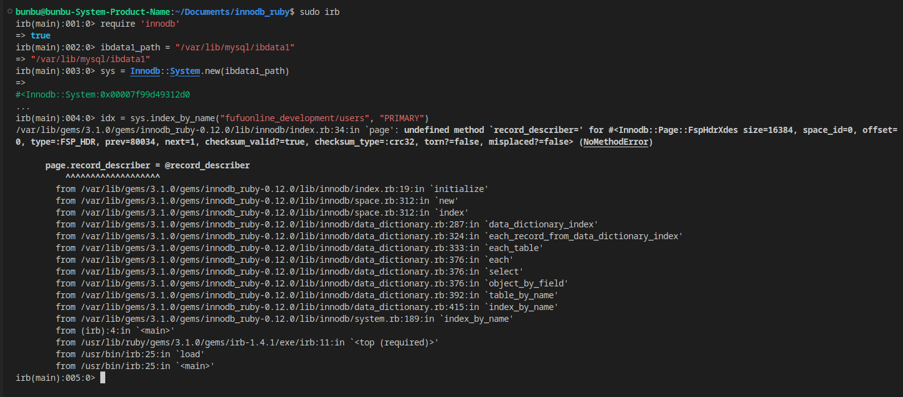

### Ở tại source này
```
sudo ruby -r rubygems -I lib bin/innodb_space ...

sudo ruby -r rubygems -I lib bin/innodb_space -s /var/lib/mysql/ibdata1 -T fufuonline_development/users -I PRIMARY index-recurse

sudo ruby -r rubygems -I lib bin/innodb_space -f /var/lib/mysql/fufuonline_development/users.ibd space-indexes
```
### Vọc
```
$ irb -r innodb
> sys = Innodb::System.new("ibdata1")
> idx = sys.index_by_name("sakila/film", "PRIMARY")
> rec = idx.binary_search([1])
```

```
sudo code /var/lib/gems/3.1.0/gems/innodb_ruby-0.12.0/lib/innodb --user-data-dir='.' --no-sandbox

https://github.com/jeremycole/innodb_ruby/pull/189/files  => gem install (https://rubygems.org/gems/innodb_ruby/versions/0.12.0) bị outdate nên lỗi với mysql 8.0
```
### Lỗi với MySQL 8.0
Root  
```
sudo gem install innodb_ruby
```
User  
```
gem install --user-install innodb_ruby
```
https://github.com/jeremycole/innodb_ruby/issues/41  
```
sudo innodb_space -s /var/lib/mysql/ibdata1 -T fufuonline_development/users -I PRIMARY index-recurse


sudo innodb_space -f /var/lib/mysql/fufuonline_development/users.ibd space-indexes
```

### Lỗi khi docker container MySQL
```
docker run --name mysql57 -e MYSQL_ROOT_PASSWORD=my-secret-pw -d mysql:5.7

docker exec -it mysql57 bash

<!-- Địa chỉ: /var/lib/mysql/ibdata1 -->
cd /var/lib/mysql

<!-- Cài ruby -->
apt-get update
apt-get install -y build-essential libssl-dev libreadline-dev zlib1g-dev
git clone https://github.com/rbenv/rbenv.git ~/.rbenv
<!-- Lỗi cài ruby -->
apt-get command not found
echo $PATH  | tr : '\n' |
while read e; do
   for i in $e/*; do
       if [[ -x "$i" && -f "$i" ]]; then
           echo $i
       fi
   done
done
<!-- Nó dùng yum -->
https://www.digitalocean.com/community/tutorials/how-to-install-ruby-on-rails-with-rbenv-on-centos-7

<!-- Lỗi -->
bash-4.2# git clone git://github.com/sstephenson/ruby-build.git ~/.rbenv/plugins/ruby-build
Cloning into '/root/.rbenv/plugins/ruby-build'...
fatal: unable to connect to github.com:
github.com[0: 20.205.243.166]: errno=Connection timed out
```

### Lỗi khi docker container Ubuntu
```
cd readme/


# Use an Ubuntu base image
FROM ubuntu:20.04

# Install MySQL server 5.7, Ruby, and dependencies
RUN apt-get update && apt-get install -y \
    mariadb-server-10.3 \
    build-essential \
    libssl-dev \
    libreadline-dev \
    curl \
    git \
    zlib1g-dev \
    curl && \
    apt-get clean && \
    rm -rf /var/lib/apt/lists/*

# Install rbenv and ruby-build
RUN git clone https://github.com/rbenv/rbenv.git ~/.rbenv && \
    cd ~/.rbenv && src/configure && make -C src && \
    echo 'export PATH="$HOME/.rbenv/bin:$PATH"' >> ~/.bashrc && \
    echo 'eval "$(rbenv init -)"' >> ~/.bashrc && \
    git clone https://github.com/rbenv/ruby-build.git ~/.rbenv/plugins/ruby-build && \
    echo 'export PATH="$HOME/.rbenv/plugins/ruby-build/bin:$PATH"' >> ~/.bashrc

# Install Ruby
RUN ~/.rbenv/bin/rbenv install 3.0.4 && ~/.rbenv/bin/rbenv global 3.0.4

# Ensure rbenv and Ruby are available
ENV PATH="/root/.rbenv/bin:/root/.rbenv/shims:${PATH}"

# Install Bundler
RUN gem install bundler

# Expose MySQL port
EXPOSE 3306


<!-- Lỗi -->
12.04 Package mysql-server-5.7 is not available, but is referred to by another package.
12.04 This may mean that the package is missing, has been obsoleted, or
12.04 is only available from another source
12.04 However the following packages replace it:
12.04   mariadb-server-10.3

<!-- Lỗi -->
[3/5] RUN git clone https://github.com/rbenv/rbenv.git ~/.rbenv &&     cd ~/.rbenv && src/configure && make -C src &&     echo 'export PATH="$HOME/.rbenv/bin:$PATH"' >> ~/.bashrc &&     echo 'eval "$(rbenv init -)"' >> ~/.bashrc &&     git clone https://github.com/rbenv/ruby-build.git ~/.rbenv/plugins/ruby-build &&     echo 'export PATH="$HOME/.rbenv/plugins/ruby-build/bin:$PATH"' >> ~/.bashrc:                                                                                                                                                        
0.207 /bin/sh: 1: git: not found
<!-- Lỗi -->
docker run --name innodb_ruby -d -p 3306:3307 innodb_ruby
docker: Error response from daemon: driver failed programming external connectivity on endpoint innodb_ruby (5395934222e5c83a9d29d49489628b679c82bebd34e46d4dab19175a02067725): Error starting userland proxy: listen tcp4 0.0.0.0:3306: bind: address already in use.

<!-- Lỗi -->
docker run --name innodb_ruby -d innodb_ruby
docker exec -it innodb_ruby bash
Error response from daemon: container 48798e65997d3bec0390ec7174474dce679b0500b24aa54ce6d1d2b56cbc5a20 is not running
```
